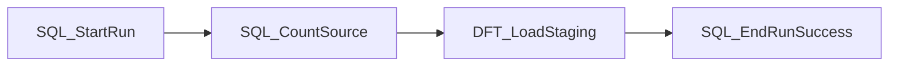

# Guide - Creation du package SSIS Cas d'etude 1

## Objectif

Creer le package `PKG_SRC_CUSTOMER_STG_SALES_CUSTOMER` dans Visual Studio pour encapsuler le flux SQL deja valide.

## Prerequis

- Visual Studio avec extension **SQL Server Integration Services Projects**
- SQL Server accessible (base `POC_ETL_IA`)
- Couche SQL validee (setup + load + qualite)

## Etape 1 - Creer le projet SSIS

1. Ouvrir Visual Studio.
2. **File > New > Project**.
3. Choisir **Integration Services Project**.
4. Nom du projet : `POC_ETL_IA_SSIS`.
5. Nom du package : `PKG_SRC_CUSTOMER_STG_SALES_CUSTOMER`.

## Etape 2 - Creer les connexions

### Connection Manager 1 : POC_ETL_IA

- Type : **OLE DB**
- Nom : `CM_POC_ETL_IA`
- Server : ton instance SQL Server
- Database : `POC_ETL_IA`

## Etape 3 - Creer les variables du package

| Variable | Type | Valeur initiale | Description |
| --- | --- | --- | --- |
| User::BatchId | Int32 | 1 | Identifiant du lot |
| User::SourceSystem | String | ERP_CUSTOMER | Systeme source |
| User::PackageName | String | PKG_SRC_CUSTOMER_STG_SALES_CUSTOMER | Nom du package |
| User::CreatedBy | String | nesrine | Auteur du run |
| User::RunId | Int32 | 0 | ID retourne par le logging |
| User::RowCountIn | Int32 | 0 | Lignes source |
| User::RowCountOut | Int32 | 0 | Lignes chargees |

## Etape 4 - Control Flow

Construire la sequence suivante :



### Tache 1 : SQL_StartRun

- Type : **Execute SQL Task**
- Nom : `SQL_StartRun`
- Connection : `CM_POC_ETL_IA`
- SQL :
```sql
EXEC usp_log_etl_run_start
    @package_name = ?,
    @source_system = ?,
    @created_by = ?;
```
- Parameter mapping :
  - Parameter 0 -> User::PackageName
  - Parameter 1 -> User::SourceSystem
  - Parameter 2 -> User::CreatedBy
- Result Set : Single row
- Result binding : `RunId` -> User::RunId

### Tache 2 : SQL_CountSource

- Type : **Execute SQL Task**
- Nom : `SQL_CountSource`
- SQL :
```sql
SELECT COUNT(*) AS cnt FROM src_customer;
```
- Result binding : `cnt` -> User::RowCountIn

### Tache 3 : DFT_LoadStaging

- Type : **Data Flow Task**
- Nom : `DFT_LoadStaging`
- Voir section Data Flow ci-dessous

### Tache 4 : SQL_EndRunSuccess

- Type : **Execute SQL Task**
- Nom : `SQL_EndRunSuccess`
- SQL :
```sql
EXEC usp_log_etl_run_end
    @run_id = ?,
    @status = 'SUCCESS',
    @row_count_in = ?,
    @row_count_out = ?;
```
- Parameter mapping :
  - Parameter 0 -> User::RunId
  - Parameter 1 -> User::RowCountIn
  - Parameter 2 -> User::RowCountOut

## Etape 5 - Data Flow (DFT_LoadStaging)

### Composants

1. **OLE DB Source**
   - Connection : `CM_POC_ETL_IA`
   - Table : `src_customer`
   - Colonnes : customer_id, customer_code, customer_name, country_code, email_address, updated_at

2. **Derived Column**
   - Nom : `DER_AddMetadata`
   - Ajouter :
     - `batch_id` (DT_I4) = `1` ou variable `@[User::BatchId]`
     - `source_system` (DT_WSTR, 100) = `"ERP_CUSTOMER"`
     - `source_extract_ts` = `updated_at`
     - `load_ts` = `(DT_DBTIMESTAMP)GETUTCDATE()`

3. **OLE DB Destination**
   - Connection : `CM_POC_ETL_IA`
   - Table : `stg_sales_customer`
   - Mapping :
     - batch_id -> batch_id
     - source_system -> source_system
     - customer_id -> customer_id
     - customer_code -> customer_code
     - customer_name -> customer_name
     - country_code -> country_code
     - email_address -> email_address
     - source_extract_ts -> source_extract_ts
     - load_ts -> load_ts

4. **Row Count** (optionnel mais recommande)
   - Placer avant la destination
   - Variable : `User::RowCountOut`

## Etape 6 - Gestion d'erreur (Event Handler)

1. Selectionner le package.
2. Onglet **Event Handlers**.
3. Executable : le package
4. Event : **OnError**
5. Ajouter une tache **Execute SQL Task** : `SQL_LogError`
6. SQL :
```sql
INSERT INTO etl_error_log (run_id, step_name, error_message)
VALUES (?, ?, ?);
```

## Etape 7 - Test du package

Avant execution :

```sql
TRUNCATE TABLE stg_sales_customer;
DELETE FROM etl_run_log;
DELETE FROM etl_error_log;
```

1. Executer le package (F5).
2. Verifier :
   - 4 lignes dans `stg_sales_customer`
   - 1 ligne `SUCCESS` dans `etl_run_log`
   - 0 ligne dans `etl_error_log`

## Etape 8 - Comparaison manuel vs IA

| Etape | Manuel | IA assistee |
| --- | --- | --- |
| Specification du package | Ce guide | Prompt `prompt_ssis_template_generation.md` |
| Temps estime | 60-90 min | 20-30 min + corrections |
| Corrections attendues | Faibles | Moyennes (mapping, variables) |

Noter ton temps reel dans `docs/06-mesure-gains/02-resultats-comparaison.md`.

## Points de revue humaine

- Verifier le mapping des colonnes Derived Column
- Verifier les types de donnees SSIS vs SQL
- Verifier que RunId est bien capture
- Verifier le comportement en cas d'erreur
