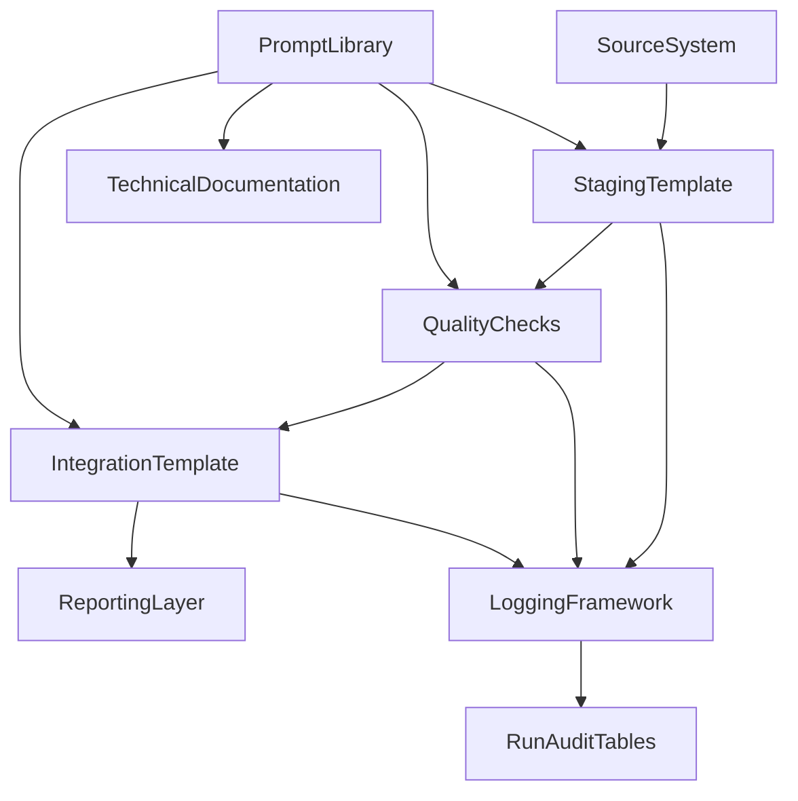

# Phase 4 - Architecture de la bibliotheque ETL

## Objectif

Construire une bibliotheque de composants reutilisables, comprehensibles et facilement demonstrables. La bibliotheque ne doit pas etre un ensemble de scripts isoles, mais un cadre de travail avec standards, templates et regles de gouvernance.

## Architecture fonctionnelle

## Composants de la bibliotheque

### 1. Templates SSIS

- package source vers staging
- package validation / nettoyage
- package chargement avec gestion d'erreur

### 2. Templates SQL

- creation de tables de staging
- procedures de chargement
- scripts de controles qualite
- scripts de logging

### 3. Standards transverses

- convention de nommage
- structure de logging
- format d'erreur
- documentation technique

### 4. Couche IA

- prompts par cas d'usage
- regles de revue
- checklist de validation humaine

## Convention de nommage proposee

- tables de staging : `stg_<domaine>_<objet>`
- tables d'integration : `int_<domaine>_<objet>`
- procedures : `usp_<action>_<objet>`
- logs : `etl_run_log`, `etl_step_log`, `etl_error_log`
- packages SSIS : `PKG_<Source>_<Cible>_<Pattern>`

## Standards minimums

Chaque composant ETL doit fournir :

- un objectif clair
- les entrees et sorties
- les parametres
- les controles qualite associes
- les logs produits
- les erreurs gerables
- une documentation courte

## Decisions d'architecture

### Pourquoi privilegier SQL Server + SSIS

- Coherence avec le sujet et le contexte entreprise vise
- Facile a expliquer dans un POC BI classique
- Bonne complementarite avec Power BI

### Pourquoi separer templates et prompts

- Un template technique doit rester versionnable et relisible
- Les prompts evoluent plus vite que les composants
- Cette separation facilite la comparaison entre manuel et IA

### Pourquoi garder une mini interface Streamlit

- Permet une demonstration plus lisible
- Donne un point d'entree unique pour presenter le POC
- Reste optionnel et leger
