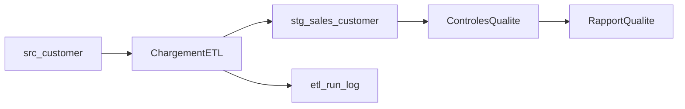

# Cas d'etude 1 - Guide d'implementation (Clients / Ventes)

## Objectif

Mettre en place un flux ETL minimal **source vers staging** avec logging et controles qualite.

## Architecture cible

## Etapes

### Etape 1 - Preparer la base SQL Server

1. Ouvrir SQL Server Management Studio (SSMS).
2. Creer une base de donnees, par exemple `POC_ETL_IA`.
3. Executer `samples/sqlserver/cas_etude_01_setup.sql`.

### Etape 2 - Charger la staging

1. Executer `samples/sqlserver/cas_etude_01_load_staging.sql`.
2. Verifier les lignes inserees dans `stg_sales_customer`.
3. Verifier l'entree dans `etl_run_log`.

### Etape 3 - Lancer les controles qualite

1. Executer `templates/quality/data_quality_checks_template.sql`.
2. Observer les anomalies attendues :
   - doublon sur `C001`
   - email nul sur `C003`

### Etape 4 - Documenter le composant

1. Completer `templates/technical_documentation_template.md` pour ce flux.
2. Noter le temps passe (approche manuelle de reference).

### Etape 5 - Reproduire avec assistance IA

1. Utiliser `prompts/prompt_ssis_template_generation.md`.
2. Utiliser `prompts/prompt_sql_quality_checks.md`.
3. Comparer temps, corrections et qualite du livrable.

## Resultats attendus

| Controle | Resultat attendu |
| --- | --- |
| Lignes source | 4 |
| Lignes staging | 4 |
| Doublons detectes | 1 (`C001`) |
| Email null | 1 (`C003`) |
| Statut run log | `SUCCESS` |

## Point SSIS (etape suivante)

Une fois la couche SQL validee, creer le package SSIS `PKG_SRC_CUSTOMER_STG_SALES_CUSTOMER` selon `templates/ssis/source_to_staging_template.md`.
