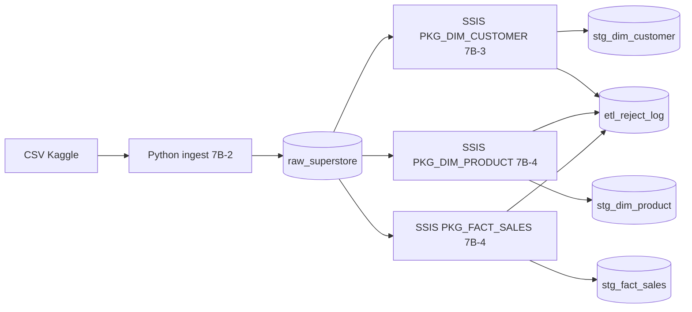

# Cas d'étude Superstore — Cadrage (Phase 7B)

| Élément | Valeur |
| --- | --- |
| Date | 2026-07-02 |
| Jeu de données | [Superstore Sales](https://www.kaggle.com/datasets/vizeno/shop-store-sales-forecasting) ou fichier Tableau `Sample - Superstore.csv` |
| Domaine | Clients / Ventes |
| Base cible | `POC_ETL_IA` |
| Statut | 7B-1 à 7B-5 validés, Phase 9 (Power BI) validée |

## 1. Objectif

Enrichir le POC avec des **données réelles Kaggle** et un flux ETL **professionnel** :

1. **Landing** Python → table brute `raw_superstore`
2. **Transformation SSIS** vers dimensions et fait
3. **Contrôles qualité** et rejets tracés
4. **Power BI** ensuite sur le modèle staging (Phase 9)

Le cas d'étude 1 synthétique (4 clients) reste la référence technique initiale.

## 2. Pourquoi Superstore ?

| Critère | Évaluation |
| --- | --- |
| Volume | ~10 000 lignes — réaliste sans être lourd |
| Structure | Clients, produits, commandes, ventes, géographie |
| BI | Standard dans l'industrie — idéal pour DAX / Power Query |
| Transformations | Permet nettoyage, lookup, rejets, règles métier |

## 3. Architecture des couches

## 4. Modèle de données

### 4.1 Landing — `raw_superstore`

Copie structurée du CSV. Une ligne = une ligne de vente (granularité transaction).

| Colonne SQL | Colonne CSV source | Type |
| --- | --- | --- |
| row_id | Row ID | INT |
| order_id | Order ID | NVARCHAR(50) |
| order_date | Order Date | DATE |
| ship_date | Ship Date | DATE |
| ship_mode | Ship Mode | NVARCHAR(50) |
| customer_id | Customer ID | NVARCHAR(50) |
| customer_name | Customer Name | NVARCHAR(255) |
| segment | Segment | NVARCHAR(50) |
| country | Country | NVARCHAR(100) |
| city | City | NVARCHAR(100) |
| state | State | NVARCHAR(100) |
| postal_code | Postal Code | NVARCHAR(20) |
| region | Region | NVARCHAR(50) |
| product_id | Product ID | NVARCHAR(50) |
| category | Category | NVARCHAR(100) |
| sub_category | Sub-Category | NVARCHAR(100) |
| product_name | Product Name | NVARCHAR(255) |
| sales | Sales | DECIMAL(18,2) |
| quantity | Quantity | INT |
| discount | Discount | DECIMAL(18,4) |
| profit | Profit | DECIMAL(18,2) |
| source_file | — | NVARCHAR(255) |
| ingest_batch_id | — | INT |
| ingest_ts | — | DATETIME2 |

### 4.2 Staging dimension client — `stg_dim_customer`

| Colonne | Description |
| --- | --- |
| batch_id | Lot ETL |
| source_system | Ex. `KAGGLE_SUPERSTORE` |
| customer_id | Clé métier |
| customer_name | Nom brut |
| customer_name_clean | TRIM + normalisation SSIS |
| segment, country, city, state, postal_code, region | Attributs client |
| is_active | 1 par défaut |
| load_ts | Horodatage de chargement |

**Règle** : 1 ligne par `customer_id` (dédoublonnage SSIS).

### 4.3 Staging dimension produit — `stg_dim_product`

| Colonne | Description |
| --- | --- |
| batch_id, source_system | Traçabilité |
| product_id | Clé métier |
| product_name, category, sub_category | Attributs produit |
| load_ts | Horodatage |

**Règle** : 1 ligne par `product_id`.

### 4.4 Staging fait ventes — `stg_fact_sales`

| Colonne | Description |
| --- | --- |
| batch_id, source_system | Traçabilité |
| row_id | Clé ligne source |
| order_id, order_date, ship_date, ship_mode | Commande |
| customer_id, product_id | Clés dimensions |
| sales, quantity, discount, profit | Mesures |
| margin_pct | Profit / Sales (si sales <> 0) |
| load_ts | Horodatage |

**Règles** :
- `customer_id` et `product_id` doivent exister dans les dimensions (Lookup SSIS)
- Lignes invalides → `etl_reject_log`

### 4.5 Rejets — `etl_reject_log`

Journal des lignes rejetées par contrôle qualité ou échec de correspondance (lookup).

## 5. Vues d'extraction SSIS (7B-3 et suivantes)

| Vue | Usage |
| --- | --- |
| `vw_extract_superstore_customers` | Clients distincts depuis raw |
| `vw_extract_superstore_products` | Produits distincts depuis raw |
| `vw_extract_superstore_sales` | Lignes de ventes depuis raw |

## 6. Transformations SSIS (implémentées)

> Les transformations (nettoyage, dédoublonnage, filtres, rejets) sont portées par le SQL de la source OLE DB plutôt que par des composants graphiques, pour plus de robustesse (voir retour d'expérience 7B-3).

### PKG_DIM_CUSTOMER (7B-3)

1. Source OLE DB sur `vw_extract_superstore_customers` avec dédoublonnage et nettoyage en SQL
2. Colonne calculée `customer_name_clean = TRIM(customer_name)`
3. Filtre qualité : `customer_id` non nul ET `customer_name` non vide
4. Rejets tracés dans `etl_reject_log`
5. Destination OLE DB → `stg_dim_customer`

### PKG_DIM_PRODUCT (7B-4)

1. Source sur la vue produits, dédoublonnée par `product_id`
2. Rejet si `product_id` ou `product_name` est nul
3. Destination `stg_dim_product`

### PKG_FACT_SALES (7B-4)

1. Source sur la vue ventes avec jointure vers les dimensions (lookup client et produit)
2. Calcul de `margin_pct`
3. Lignes sans correspondance dimension → rejet
4. Destination `stg_fact_sales`

## 7. Contrôles qualité (7B-5 — 12/12 PASS)

| ID | Contrôle | Seuil attendu |
| --- | --- | --- |
| QC-SS-01 | Volume raw | > 9 000 lignes |
| QC-SS-02 | Clients distincts | > 700 |
| QC-SS-03 | Produits distincts | > 1 800 |
| QC-SS-04 | `customer_id` nul en staging | 0 |
| QC-SS-05 | `product_id` nul en staging | 0 |
| QC-SS-06 | Fait sans dimension | 0 |
| QC-SS-07 | Ventes négatives | 0 |
| QC-SS-08 | Discount hors [0, 1] | 0 |
| QC-SS-09 | Doublons `customer_id` | 0 |
| QC-SS-10 | Doublons `product_id` | 0 |
| QC-SS-11 | Réconciliation volume fait vs raw | = raw |
| QC-SS-12 | Packages SSIS en succès | = 3 |

## 8. Ordre d'exécution

| Étape | Script / action | Statut |
| --- | --- | --- |
| 1 | `cas_etude_superstore_setup.sql` | Validé |
| 2 | Télécharger le CSV (voir `samples/python/README_superstore.md`) | Validé |
| 3 | `ingest_superstore_to_sql.py` (7B-2) | Validé |
| 4 | Packages SSIS `PKG_DIM_CUSTOMER`, `PKG_DIM_PRODUCT`, `PKG_FACT_SALES` (7B-3, 7B-4) | Validé |
| 5 | Contrôles qualité + Streamlit (7B-5) | **Validé** — voir `10-validation-superstore-7b5.md` |
| 6 | Modèle Power BI (Phase 9) | Validé — voir `11-guide-powerbi-superstore-phase9.md` |

## 9. Phase 9 — Power BI

| Étape | Fichier |
| --- | --- |
| Guide d'implémentation | `docs/05-cas-etude/11-guide-powerbi-superstore-phase9.md` |
| Power Query (M) | `samples/powerbi/superstore/superstore_power_query.m` |
| Mesures DAX | `samples/powerbi/superstore/superstore_dax_measures.md` |
| Validation SQL | `samples/sqlserver/cas_etude_superstore_validate_powerbi.sql` |

## 10. Critères de validation 7B-1

- [x] Script `cas_etude_superstore_setup.sql` exécuté sans erreur
- [x] Tables `raw_superstore`, `stg_dim_*`, `stg_fact_sales`, `etl_reject_log` créées
- [x] Vues d'extraction présentes
- [x] Framework de logging existant préservé (`etl_run_log`, `etl_error_log`)
- [x] Cas d'étude 1 (tables `src_customer`, `stg_sales_customer`) non supprimé

## 11. Prochaine étape

**Phase 10** : évaluation ciblée du protocole MCP (Model Context Protocol) avec Claude pour l'analyse et l'enrichissement du modèle Power BI.
